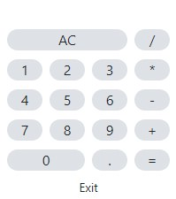

# Calculator with Electron, TypeScript, React

An exercise in Electron. Electron is a cross-platform framework for desktop applications that runs off of Chromium. This allows a web development skillset to be applied to developing desktop applications across multiple platforms.

## Install

```
npm install
npm run build-pug
npm run build-preload
npm start
```


